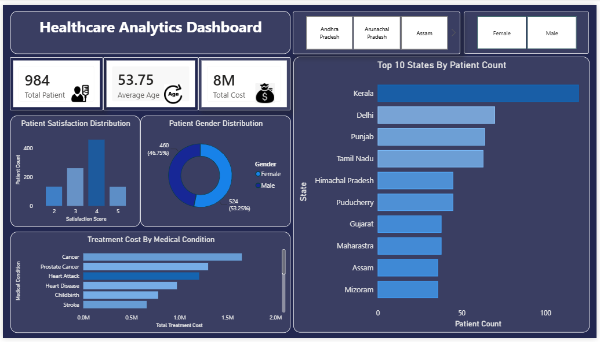

# Healthcare Analytics Dashboard

## 📌 Overview
This project is an interactive Healthcare Analytics Dashboard built using Microsoft Power BI. It helps analyze patient data, treatment costs, gender distribution, patient satisfaction, and state-wise patient count through interactive visualizations.

## 🛠 Tools Used
- Microsoft Power BI
- DAX
- Excel

## 📊 Dashboard Features
- Total Patients KPI
- Average Age KPI
- Total Treatment Cost
- Patient Gender Distribution
- Patient Satisfaction Distribution
- Top 10 States by Patient Count
- Treatment Cost by Medical Condition
- Interactive Filters (State and Gender)

## 🚀 How to Use

1. **Download the files**
   - Download `Healthcare_Analytics_Dashboard.pbix` from this repository.

2. **Open in Power BI Desktop**
   - Install [Power BI Desktop](https://powerbi.microsoft.com/desktop/) if you don't have it already (free).
   - Open the `.pbix` file directly in Power BI Desktop.

3. **Explore the dashboard**
   - Use the **State** and **Gender** slicers at the top to filter the data.
   - Hover over any chart (bar, donut, etc.) to see detailed tooltips.
   - Click on any bar/segment to cross-filter other visuals on the page.

4. **View without Power BI**
   - If you don't have Power BI installed, check the [`Healthcare_Analytics_Dashboard.pdf`](Healthcare_Analytics_Dashboard.pdf)  file in this repo for a static preview of all visuals.

## ⚙️ Requirements
- Power BI Desktop (Windows only) — [Download here](https://powerbi.microsoft.com/desktop/)

## 🎯 Key Insights
- Analyze patient demographics.
- Compare treatment costs across medical conditions.
- Monitor patient satisfaction.
- Identify states with the highest patient count.

## Dashboard Preview

## 👩‍💻 Author
**Ashima Pradhan**
